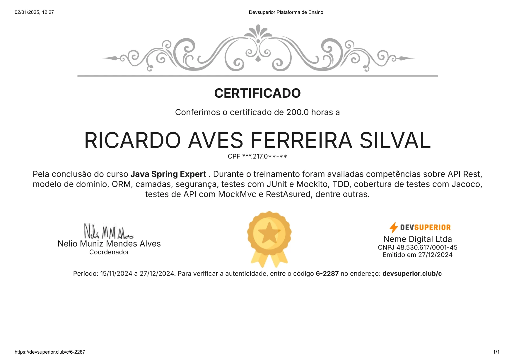

## _Roadmap to Spring Certification_ <br />

I started working on getting a Spring Certification and decide to dive into it through @devsuperior training to be better 
prepared to tackle the best. There are 3 courses available, Spring Professional, Spring Expert and Spring Reference.
This is how I played with the challenges of the Spring Expert with focus on Unit Tests using JUnit, Integration Tests using MockMVC and
RestAssured and of course lots of code based on TDD.

## _Table of contents_

- [_Overview_](#overview)
- [_Requirements_](#requirements)
- [_Project Structure_](#requirements)
- [_Howto Build and Run_](#requirements)
- [_Screenshot_](#screenshot)
- [_Links_](...)
- [_Built with_](#built-with)
- [_Code Snippet_](#requirements)
- [_Continued development_](#continued-development)
- [_Useful resources_](#useful-resources)
- [_Author_](#requirements)
- [_Portfolio_](#requirements)

## _Overview_

Here you will find the code challenges proposed over the training using Java 21 and Spring Boot 3.X where the focus is how to 
implement automated tests, starting with unit tests and walking thru the application layers up to end end to end tests.
Visit https://devsuperior.com.br/curso-java-spring-expert to know details of the training.

<br />

## _Requirements_

- Spring Boot project setup
- Fundamentals of automated testing
- TDD - Test Driven Development
- JUnit
- Java Vanilla tests
- Factory pattern
- Spring annotation for testing
- JUnit fixtures
- Unit tests
- Mockito
- MockBean
- Repository tests
- Service layer tests
- Web layer tests
- MockMvc
- Integration tests
- Data validation
- Custom validation
- Security, login, access control
- OAuth2, JWT, Cors
- Database queries
- Spy Mock
- Test coverage
- Jacoco
- API tests
- RestAssured
<hr />

## _Project Structure_

- docs
    - javadocs
- src
    - main
    - java
        - br.dev.ferreiras.springExpert/challengeOne
            - config
            - controller
                - handlers
            - dto
            - entity
            - enums
            - mapper
            - repository
            - services
                - exceptions
    - resources
        - db.migration
        - certs
    - test
-

## _Howto Build and Run_

  ```
  - H2 Database : http://127.0.0.1:8080/h2-console
  - profile active: dev
  - service socket: 127.0.0.1:8080
  - tweak a few knobs to get it up and running
  
```

## _Screenshot_

[]()

## _Links_

- Live Site URL: <a href=https://devsuperior.com.br/curso-java-spring-expert" target="_blank">@devsuperior</a>

## _Built with_

[](https://skillicons.dev)

## _Code Snippet_

```java
import java.util.List;

/**
 *
 * @author ricardo@ferreiras.dev.br
 * @version 1.1.12.01
 * @since 1.0
 *
 */

ExtendWith(SpringExtension.class)
@ContextConfiguration
public class UserServiceTests {

  @InjectMocks
  private UserService userService;

  @Mock
  private UserRepository userRepository;

  @Mock
  private CustomUserUtil userUtil;

  private String existingUsername, nonExistingUsername;
  private UserEntity userEntity;
  private List<UserDetailsProjection> userDetails;

  @BeforeEach
  void setUp() throws Exception {

    existingUsername = "maria@gmail.com";
    nonExistingUsername = "ricardo@gmail.com";
    userEntity = UserFactory.createUserEntity();
    userDetails = UserDetailsFactory.createCustomAdminClientUser(existingUsername);

    Mockito.when(userRepository.findByUsername(existingUsername)).thenReturn(Optional.of(userEntity));
    Mockito.when(userRepository.findByUsername(nonExistingUsername)).thenThrow(UsernameNotFoundException.class);

    Mockito.when(userRepository.searchUserAndRolesByUsername(existingUsername)).thenReturn(userDetails);
    Mockito.when(userRepository.searchUserAndRolesByUsername(nonExistingUsername)).thenReturn(new ArrayList<>());

  }

  @Test
  public void authenticatedShouldReturnUserEntityWhenUserExists() {

    Mockito.when(userUtil.getLoggedUsername()).thenReturn(existingUsername);
    UserEntity user = userService.authenticated();

    Assertions.assertNotNull(user);
    Assertions.assertEquals(user.getUsername(), existingUsername);

  }

  @Test
  public void authenticatedShouldThrowUsernameNotFoundExceptionWhenUserDoesNotExists() {

    Mockito.doThrow(ClassCastException.class).when(userUtil).getLoggedUsername();

    Assertions.assertThrows(UsernameNotFoundException.class, () -> {
      userService.authenticated();
    });

  }

  @Test
  public void loadUserByUsernameShouldReturnUserDetailsWhenUserExists() {

    UserDetails user = userService.loadUserByUsername(existingUsername);

    Assertions.assertNotNull(user);
    Assertions.assertEquals(user.getUsername(), existingUsername);

  }

  @Test
  public void loadUserByUsernameShouldThrowUsernameNotFoundExceptionWhenUserDoesNotExists() {

    Assertions.assertThrows(UsernameNotFoundException.class, () -> {
      userService.loadUserByUsername(nonExistingUsername);
    });

  }
}

``` 

## _Continued development_

- Unit Tests -OK
- Provide a Json to FrontEnd including
    - delivery status of each operation to frontend - OK
    - count of operations consumed by subscriber - OK
- Subscriber Authentication - OK
    - Spring JWT-OAuth2 - OK
- Records Pagination - OK

### _Useful resources_

- [https://spring.io] Awesome Java framework!.
- [https://start.spring.io/]  Handy startup tool.
- [https://mvnrepository.com] Tools that help tackle the beast

## _Author_

<a href="mailto:ricardo@ferreiras.dev.br">Ricardo Ferreira</a>

## - _Portfolio_

<a href="https://www.ferreiras.dev.br" target="_blank">My Portfolio...</a>

